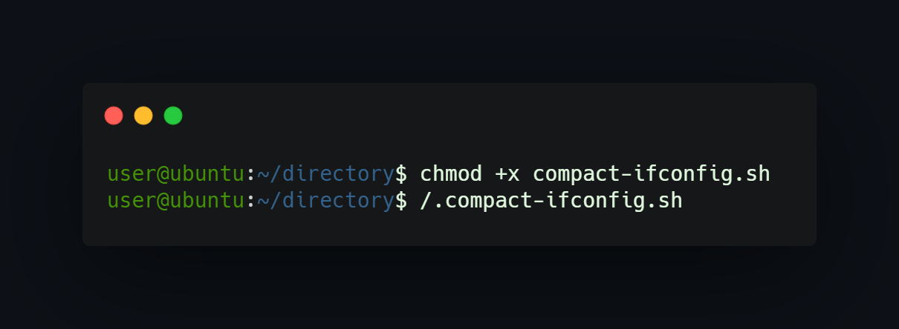

## What project do?
___
This project helps in filtering ifconfig results only to: interface name, ip address, mac address on linux distros (script omits loopback). This script uses 'sed' command to filter results. 
## How to install?
___
To check script just execute the 'compact-ifconfig.sh' file using ./file in terminal.

## How to use?
___
If you having troubles in executing script add execute rights via chmod command or use Ubuntu to check how script works.

<!--https://banner.godori.dev/-->
<!--https://shields.io/-->
<!---->